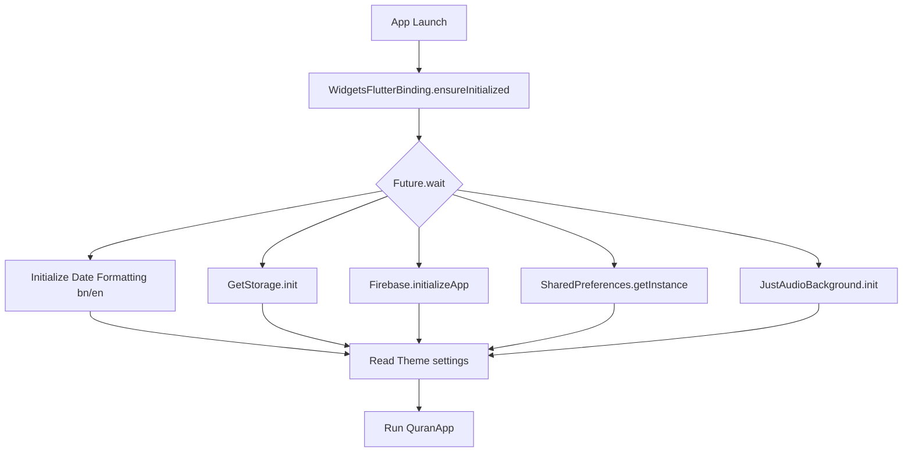

# 🕌 Al-Quran App

A premium, production-ready Islamic Music & Quran application built with Flutter (GetX) and Firebase. Inspired by modern user experiences, this application provides an elegant, responsive, and visual platform for learning, tracking, and reciting Al-Quran.

## ✨ Key Features

### 📖 1. Al-Quran Module
* **Surah & Para (Juz) Lists**: Tabbed navigation with comprehensive search indexing.
* **Uthmanic Arabic Script**: Beautiful text rendering with customizable Arabic and translation font sizes.
* **Bangla & English Translations**: Inline verse-by-verse translations.
* **Audio Recitations**: High-quality single-ayah audio playback with Qari selection and auto-play next progression.
* **Bookmarks & Last Read Tracker**: Quick-resume reading banners to continue from where you left off.
* **Offline Cache**: Pre-download and cache Surahs for reading without an active internet connection.

### 🕋 2. Daily Deen Helpers
* **Prayer Times**: Location-based timings (Fajr, Sunrise, Dhuhr, Asr, Maghrib, Isha) with live countdown remaining timers.
* **Qibla Compass**: Live direction tracker withKaaba alignment indicators and vibration feedback.
* **Salah Step-by-Step Guide**: Illustrated instructions from Niyyah to Salam, including phonetics and Arabic recitations.
* **New Muslim Guide**: Introductory pillars of faith and visual guides for performing Wudu (ablution).

### ⚙️ 3. Utility Modules
* **Duas & Azkar**: Categorized list of daily supplications (with copy/share options).
* **Digital Tasbih**: Clicker counter with limit/round triggers and haptic feedback.
* **Daily Tracker**: Checklist showing completion rates of daily salahs and Quran readings.
* **FCM Push Notifications**: Synchronized Firebase topic updates (`all`) with toggles in settings.
* **Theme Support**: Premium dark and light theme aesthetics.

---

## 🛠️ Tech Stack

* **State Management**: GetX (Reactive architecture)
* **Local Database**: Hive (Cache-first offline storage)
* **Backend Integration**: Firebase Auth, Cloud Firestore (Support Tickets), Firebase Cloud Messaging (FCM)
* **Audio Playback**: `just_audio`, `audio_service`, `just_audio_background`
* **Sensor Services**: `geolocator`, `flutter_qiblah`, `vibration`

---

## 🔄 How the App Works (App Workflow & Architecture)

Here is a breakdown of how the Qurania application operates under the hood, from initialization to feature execution:

### 1. Application Initialization Flow (`lib/main.dart`)
When the app launches, it prioritizes a fast startup time by initializing critical core components in parallel using `Future.wait`:

* **Firebase & Crashlytics**: Registers error triggers for both Flutter-framework level and asynchronous platform-level errors.
* **Audio Background**: Configures `JustAudioBackground` so recitation continues even when the screen is off or the app is minimized.

### 2. State Management & Dependency Injection (`lib/bindings/app_binding.dart`)
We use **GetX** for dependency injection. Global services are registered inside [app_binding.dart](file:///c:/Users/Sourav%20sanyal/OneDrive/Desktop/Quran%20App/lib/bindings/app_binding.dart):
* **Singletons (`Get.put`)**: Keep persistent active components such as `SettingsController` (theme/language preferences), `AuthController`, `NotificationsController`, `AudioPlayerService`, and `PrayerTimeController` always running in memory.
* **Lazy Controllers/Providers (`Get.lazyPut`)**: Heavy services (like `QuranRepository` and API providers) are instantiated only when the user visits the related modules, freeing up resources.

### 3. Cache-First Data Lifecycle (`lib/data/repositories/quran_repository.dart`)
The app utilizes a dual-layer strategy (Remote API + Local Hive Cache) to enable offline-ready features:
1. **Hive Storage Boxes**: Divided into logical boxes (`surah_list_v2`, `surah_data_v2`, `para_data_v2`, `bookmarks_v2`, `last_read_v2`).
2. **Read Request Flow**:
   * The controller calls `getSurahAyahs(surahNumber)`.
   * `QuranRepository` checks the local Hive box for cached JSON.
   * **If Cache Exists**: Parses the local string into Dart models and returns it instantly.
   * **If Cache Misses**: Calls `QuranApiProvider` to fetch the Arabic, English, Bangla, and Transliteration editions in parallel, saves the result to Hive for future offline access, and returns the models.

### 4. Audio Playback & Streaming (`lib/services/audio_player_service.dart`)
Audio streaming is highly optimized using `just_audio`:
* **On-the-fly Caching**: On mobile, it uses `LockCachingAudioSource`. This plays the audio stream from CDN (e.g. `cdn.islamic.network`) and simultaneously saves it locally in the device's document directory (`/audio_cache/`).
* **Auto-Play Next**: Listens to the player state stream. Once an Ayah completes, it auto-advances the playlist to the next Ayah.
* **Qari Profile Adjustments**: Seamlessly matches the stream URL to the selected reciter's specific bitrate configurations (e.g., 64kbps, 128kbps).

### 5. Multi-lingual Phonetic Search System (`lib/modules/quran/quran_controller.dart`)
The search engine matches user inputs using flexible normalization rules:
* Normalizes phonetic searches by stripping punctuation, extra spacing, and common phonetic duplicates (e.g., standardizing `aa` -> `a`, `ee` -> `i`, `al-` prefixes).
* Maps Bangla phonetic matches (e.g., typing 'ফাতিহা' maps to Surah 1, 'বাকারা' maps to Surah 2).
* Supports Arabic text input matching, Surah index numbers, and English translations.

